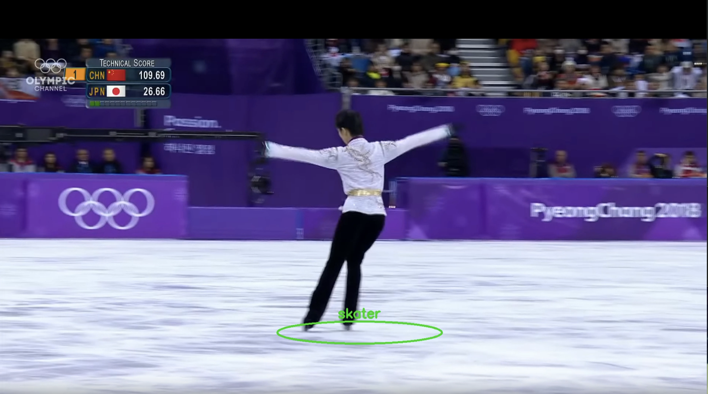

# Figure Skater Annotation

## What it does

This repo combines a real-time YOLOv8 human detector with a following method to annotate only a skater.
For every frame *t* I isolate the skater and compute:

1. **Track centroid**

   $$
   \mathbf{u}_t = (u_t,\; v_t)
   $$

2. **Estimate camera shift**

   $$
   \Delta\mathbf{u}_{\text{cam}} = (\Delta u_{\text{cam}},\; \Delta v_{\text{cam}})
   $$

3. **Object motion**

   $$
   \Delta\mathbf{u}_{\text{obj}}
   = \mathbf{u}_t - \mathbf{u}_{t-1} - \Delta\mathbf{u}_{\text{cam}}
   $$

   $$
   v = \frac{\lVert \Delta\mathbf{u}_{\text{obj}}\rVert_2}{\Delta t}
   $$

4. **Ground-contact test**

   $$
   x_c = \frac{x_1 + x_2}{2}, \qquad y_b = y_2
   $$

   $$
   \bar I = \frac{1}{w}\sum_{x = x_c - w/2}^{x_c + w/2} I(x, y_b)
   $$

   If $\bar I \ge T$ ⇒ `ground_contact = true`, else `false`.

Each skater is finally boxed in a green ellipse.

## Requirements  

# clone & enter
git clone https://github.com/<your-name>/figureskater_annotation_yolo.git
cd figureskater_annotation_yolo

# (a) set up Python
python -m venv .venv           # once
source .venv/bin/activate
pip install -r requirements.txt

# (b) drop your video in input/
mkdir -p input
cp /path/to/your_video.mp4 input/

# (c) run
python main.py --video input/my_video.mp4 --out output/ --device cpu

# Demo
## Before

## After

